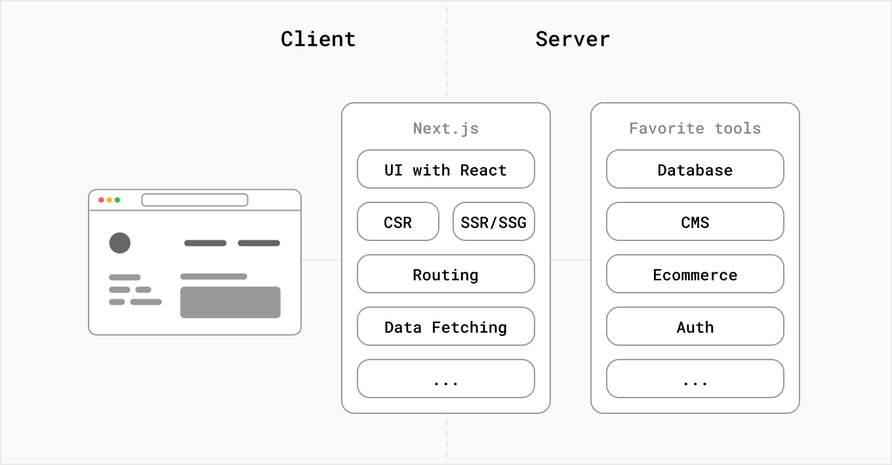
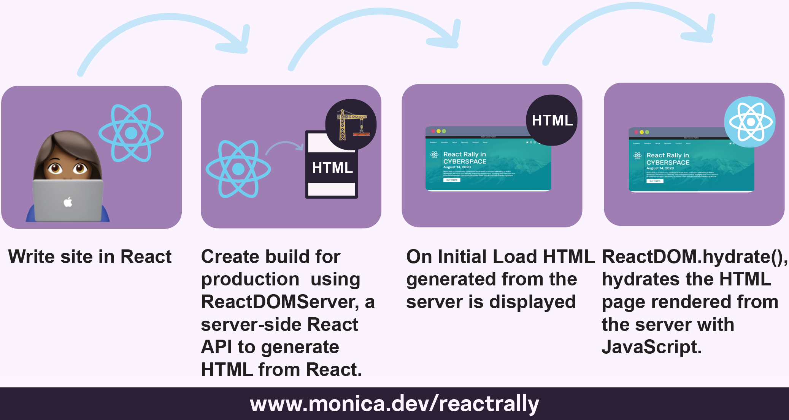
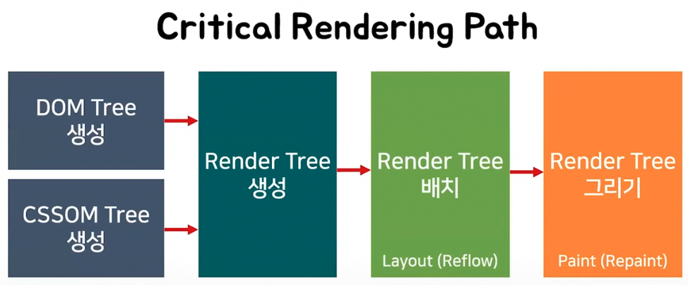
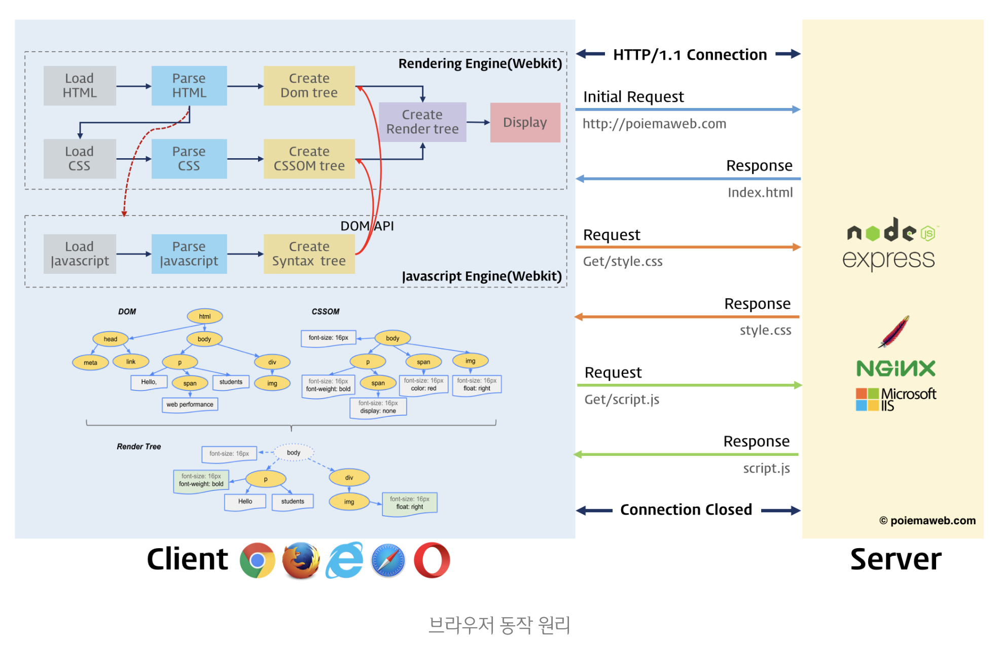
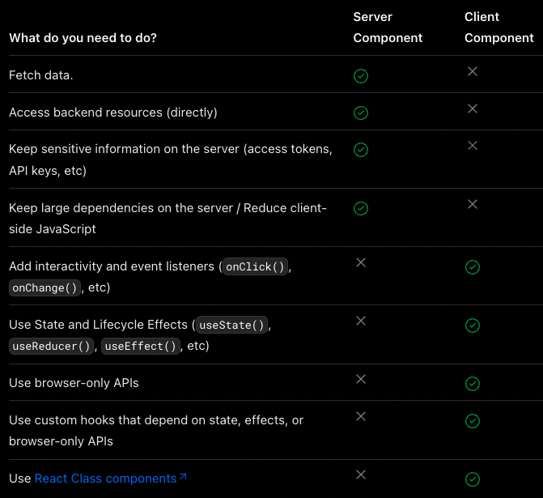

# 넥스트js

📃 공식문서를 읽으면서 공부한 내용을 정리하고, 토이프로젝트에 직접 적용해봅니다

📖 바로 이동

- [넥스트js 란?](https://github.com/Superduper-India/toy-projects/tree/main/00-next-js#%EB%84%A5%EC%8A%A4%ED%8A%B8js-%EB%9E%80)
- [hydration](https://github.com/Superduper-India/toy-projects/tree/main/00-next-js#%ED%95%98%EC%9D%B4%EB%93%9C%EB%A0%88%EC%9D%B4%EC%85%98hydration---%EC%88%98%ED%99%94%EC%9E%91%EC%9A%A9)
- [리액트 에센셜](https://github.com/Superduper-India/toy-projects/tree/main/00-next-js#%EB%A6%AC%EC%95%A1%ED%8A%B8-%EC%97%90%EC%84%BC%EC%85%9C-react-essentials)
- [페이지와 레이아웃](https://github.com/Superduper-India/toy-projects/tree/main/00-next-js#%ED%8E%98%EC%9D%B4%EC%A7%80%EC%99%80-%EB%A0%88%EC%9D%B4%EC%95%84%EC%9B%83)
- [데이터 가져오기](https://github.com/Superduper-India/toy-projects/tree/main/00-next-js#%EB%8D%B0%EC%9D%B4%ED%84%B0-%EA%B0%80%EC%A0%B8%EC%98%A4%EA%B8%B0)

<br/>

# 💡 핵심 개념

> ### 참고자료
>
> [넥스트 문서](https://nextjs.org/docs) <br/> [넥스트 블로그](https://nextjs.org/blog) <br/> [넥스트 FOUNDATIONS](https://nextjs.org/learn/foundations/about-nextjs?utm_source=next-site&utm_medium=nav-cta&utm_campaign=next-website) <br/> [Next.js의 Hydrate란?](https://helloinyong.tistory.com/315)

## 넥스트js 란?

넥스트js는 빠른 웹 애플리케이션을 만들기 위한 빌딩 블록을 제공하는 유연한 React`프레임워크`이다.

```
여기서 프레임워크란, 넥스트js가 리액트에 필요한 도구 및 구성을 처리하고 앱에 대한 추가 구조, 기능 및 최적화를 제공한다는 의미이다.
```

최신 앱을 구축할 때 고려해야 할 사항들은 다음과 같다.
<br/>

- 사용자 인터페이스(User Interface): 사용자가 앱을 소비하고 상호작용하는 방법
- 라우팅(Routing): 사용자가 앱의 여러 부분을 탐색하는 방법
- 데이터 가져오기(Data Fetching): 데이터가 있는 위치와 데이터를 가져오는 방법
- 렌더링(Rendering): 정적 또는 동적 콘텐츠를 렌더링하는 시기와 위치
- 통합(Integrations): 내가 사용하는 third-party(제 3자) 서비스(CMS, 인증, 결제 등) 및 연결 방법
- 인프라(Infrastructure): 앱 코드(서버리스, CDN, Edge 등)를 배포, 저장 및 실행하는 곳
- 성능(Performance): 최종 사용자를 위해 앱을 최적화하는 방법
- 확장성(Scalability): 팀, 데이터 및 트래픽이 증가함에 따라 앱이 적응하는 방식
- 개발자 경험(Developer Experience): 앱 구축 및 유지 관리 팀의 경험

그리고 앱의 각 부분에 대해 솔루션을 직접 구축할지 아니면 라이브러리 및 프레임워크와 같은 다른 도구를 사용할지 결정해야 한다.

기존의 리액트js는 상호작용하는 사용자 인터페이스를 구축하기 위한 js라이브러리다. 사용자 인터페이스란 사용자가 화면에서 보고 상호작용하는 요소를 말한다.
<br/>
리액트는 라이브러리로서 UI를 빌드하는데 유용한 기능을 제공하지만 앱에서 해당 기능을 사용할 권한을 개발자에게 준다.

리액트의 성공 중 일부는 앱구축의 다른 측면에 대해 상대적으로 의견이 분분하다는 것이다. 이로 인해 타사 도구 및 솔루션이 번성하는 생태계가 탄생했다.

그러나 완전한 React앱을 처음부터 구축하려면 약간의 노력이 필요하다는 의미기도 하다. 개발자는 일반적인 앱 요구 사항에 맞게 도구를 설계하고 솔루션을 처음부터 다시 만드는데 시간을 할애해야 한다.

  

<br/>

## 하이드레이션(hydration) - 수화작용

웹 개발에서 hydrate는 다음과 같은 프로세스를 말한다.

- 서버단에서 Pre-Rendering된 html페이지와 번들링된 js파일을 클라이언트에게 보낸다.
- 클라이언트단에서 html코드와 js이벤트 리스너 및 상태를 연결한다.
  

기존의 React는 js파일만을 이용하여 웹 화면을 구성하는 원리를 갖고있어서 html코드는 아래와 같이 안에 내용이 하나도 없다. 이는 CSR(Client Side Rendering)이 SEO에 적합하지 않은 이유기도 하다.

```javascript
// public/index.html

<!DOCTYPE html>
<html lang="en">
  <head>
    <meta charset="UTF-8" />
    <title>Title</title>
  </head>
  <body>
    <div id="root"></div>
  </body>
</html>
```

단순 뼈대만 있는 html document와 js파일들을 클라이언트로 모두 보낸 뒤, 클라이언트 단에서 js코드들을 통해 웹 화면을 렌더링하며 페이지를 그리게 된다. 그리고 렌더링을 한 뒤에도 페이지 내 동작하는 모든 이벤트 또한 js로 인해 일어나게 된다.
<br/>

아래 코드처럼 `index.js`의 js코드에서 모든 화면을 렌더링한 뒤 html dom요소 중 root라는 아이디를 가진 엘리먼트를 찾아서 하위로 주입을 하게 된다.

```javascript
// src/index.js

import React from "react";
import ReactDOM from "react-dom";
import App from "./src/App";

ReactDOM.render(<App />, document.getElementById("root"));
```

넥스트js는 클라이언트에게 웹 페이지를 보내기 전에 서버단에서 미리 웹 페이지를 **Pre-Rendering**한다. 그리고 Pre-Rendering으로 인해 생성된 html document를 클라이언트에게 전송한다.
<br/>

그런데 이 시점에서 클라이언트가 받은 웹 페이지는 단순히 웹 화면만 보여주는 html일 뿐이고, js요소들이 하나도 없다. 이는 웹 화면을 보여주고 있지만, 특정 js모듈 뿐 아니라 단순 클릭과 같은 이벤트 리스너들이 각 웹 페이지의 dom요소에 하나도 적용되지 않은 상태임을 말한다.
<br/>

**서버**에서는 Pre-Rendering된 웹 페이지를 클라이언트에 보내고 나서, 바로 **리액트**가 번들링 된 js코드들을 클라이언트에 전송한다. 그리고 이 js코드들이 이전에 보내진 html dom요소 위에서 한번 더 렌더링을 하면서, 각자 자기 자리를 찾아가며 **매칭**된다.
이 과정을 **Hydrate**라고 부른다. 이는 마치 js코드들이 dom요소 위에 물을 채우듯 필요로 하던 요소들을 채운다하여 이와같은 용어를 쓴다고 한다.
<br/>

서버에서 한 번 렌더링하고, 클라이언트에서도 한 번 더 렌더링하면 비효율적인 것이 아닌가 하는 의문이 들 수 있다. 하지만 서버단에서 빠르게 Pre-Rendering하고 유저에게 빠른 웹 페이지로 응답할 수 있다는 것에 더욱 큰 이점을 가져갈 수 있다. 심지어 Pre-Rendering한 document는 모든 js요소들이 빠진 굉장히 가벼운 상태이므로 클라이언트에게 빠른 로딩이 가능하다. 클라이언트 단에서 js가 렌더링할 때, 단지 각 dom요소에 js속성을 매칭시키기 위한 목적이므로 실제 웹 페이지를 다시 그리는 과정까지는 하지 않는다. 

이와 같은 pre-rendering과 hydrate로 인해 브라우저 렌더링 과정(CRP)중 일부가 생략되는 것은 아니다. 대신 과정중 일부가 효율적인 렌더링 및 상호 작용을 위해 최적화되고, 조정될 수 있다.




<br/>

## 리액트 에센셜 (React Essentials)

서버 컴포넌트와 같은 React의 최신 기능에 익숙해지는 것이 넥스트js로 앱을 구축할 때 도움이 된다. 특히 서버 및 클라이언트 컴포넌트를 사용하면 `클라이언트 사이드` 앱의 **풍부한 상호 작용**과 기존 서버 렌더링의 **향상된 성능**을 결합할 수 있다. 서버 컴포넌트와 클라이언트 컴포넌트의 차이점, 사용 케이스 및 권장 패턴 등을 살펴보자.

```
여기서 클라이언트 사이드(client-side)란 네트워크의 한 방식인 클라이언트-서버 구조의 클라이언트 쪽에서 행해지는 처리를 말한다.
```

> ### 서버 컴포넌트

리액트는 SPA와 같은 클라이언트 사이드 앱 전체를 렌더링하는 대신, 용도에 따라 컴포넌트를 렌더링할 위치를 선택할 수 있는 유연성을 제공한다. 아래와 같이 페이지를 분할하면 대부분의 컴포넌트가 상호작용을 하지 않기 때문에 서버 컴포넌트로 서버에서 pre-rendering될 수 있다. 더 작은 단위의 상호작용 UI가 있다면, 클라이언트 컴포넌트로 뿌려줄 수 있다. 이것은 넥스트js 서버 우선 접근 방식과 일치한다.


서버 컴포넌트를 통해 개발자는 서버 인프라를 더 잘 활용할 수 있다. 예를 들어 이전에 클라이언트의 js번들 크기에 영향을 미쳤던 큰 **종속성이 대신 서버에 완전히 남아서 성능이 향상**될 수 있다.

- 초기 페이지 로드가 더 빨라진다.
- 클라이언트 사이드 js번들 크기가 줄어든다.
- 기본 클라이언트 사이드 런타임은 캐시 가능하고, 크기를 예측할 수 있으며 앱이 커져도 증가하지 않는다.
- 추가적인 js는 클라이언트 컴포넌트를 통해 앱에서 클라이언트 사이드 상호 작용이 사용되는 경우에만 추가된다.

라우트가 넥스트js와 함께 로드되면, 최초 html이 서버에서 렌더링된다. 그런다음, 이 html은 브라우저에서 점진적으로 향상되어 클라이언트가 넥스트js 및 리액트의 클라이언트 사이드 런타임을 비동기적으로 로드함으로써 클라이언트가 앱을 인계하고 상호작용을 추가할 수 있다.

`app/`경로 아래의 모든 파일은 기본적으로 서버 컴포넌트이다. 이에 선택적으로 `"use client"`지시문을 사용하여 클라이언트 컴포넌트에 옵트인할 수도 있다.

> ### 클라이언트 컴포넌트

클라이언트 컴포넌트를 사용하면 앱에 클라이언트 사이드 상호작용을 추가할 수 있다. 아래와 같이 `"use client"`지시문을 사용하여 클라이언트 컴포넌트를 사용할 수 있다.

```jsx
"use client";

import { useState } from "react";

export default function Counter() {
  const [count, setCount] = useState(0);

  return (
    <div>
      <p>You clicked {count} times</p>
      <button onClick={() => setCount(count + 1)}>Click me</button>
    </div>
  );
}
```

아래와 같이 서버와 클라이언트의 경계를 짓기 위해 `import`문으로 가져온 파일 맨 위에 배치한다. 파일에 `"use client"`로 정의하면 자식 컴포넌트를 포함한 가져온 모든 모듈들은 클라이언트 번들의 일부로 간주된다.


위에서 언급했듯이 `"use client"`지시문으로 시작하는 모듈에서 정의하거나 가져오지 않는 한 모든 컴포넌트의 기본값은 서버다. 적절한 사용 케이스는 아래 표를 참고하자.

> ### 서버 및 클라이언트 컴포넌트 사용 케이스
>
> 

<br/>

> ### 패턴

앱의 성능을 개선하려면 **서버 컴포넌트**에 클라이언트 컴포넌트를 가져와서 사용하는 것이 좋다.

예를 들어 `<Layout />`컴포넌트에 정적 요소(로고, 링크 등)를 렌더링하는 `<Logo />`와 상태를 사용하는 검색창인 `<SearchBar />`컴포넌트가 있다고 해보자.

전체 레이아웃을 클라이언트 컴포넌트로 만드는 대신 상호작용관련 로직을 `<SearchBar />`와 같은 클라이언트 컴포넌트로 빼고 **전체 레이아웃은 서버 컴포넌트로 유지한다.** 이는 레이아웃의 모든 컴포넌트 js를 클라이언트에 보낼 필요가 없음을 의미한다.

```tsx
// SearchBar is a Client Component
import SearchBar from "./searchbar";
// Logo is a Server Component
import Logo from "./logo";

// Layout is a Server Component by default
export default function Layout({ children }: { children: React.ReactNode }) {
  return (
    <>
      <nav>
        <Logo />
        <SearchBar />
      </nav>
      <main>{children}</main>
    </>
  );
}
```

서버와 클라이언트 컴포넌트는 동일한 컴포넌트 트리에서 합쳐질 수 있다. 리액트가 아래와 같이 렌더링한다.

- 서버에서 리액트는 결과를 클라이언트에 보내기 전에 모든 서버 컴포넌트를 렌더링 한다.
  - 이는 클라이언트 컴포넌트 내에 중첩된 서버 컴포넌트가 포함된다.
  - 클라이언트 컴포넌트는 이 단계를 건너뛴다.
- 클라이언트에서 리액트는 서버 컴포넌트의 렌더링된 결과에서 클라이언트 컴포넌트와 슬롯을 렌더링하여 서버와 클라이언트에서 수행된 작업을 병행한다.
  - 서버 컴포넌트가 클라이언트 컴포넌트 내에 중첩된 경우, 렌더링된 컨텐츠는 클라이언트 컴포넌트 내에 적절하게 배치된다.

```
넥스트js에서는 초기 페이지 로드 중에 위 단계에서 서버 컴포넌트의 렌더링된 결과와 클라이언트 컴포넌트가 모두 서버에서 html로 pre-rendering되어 더 빠른 초기 페이지 로드를 생성한다.
```

위에서 설명한 렌더링 흐름을 고려할 때 클라이언트 컴포넌트에 서버 컴포넌트를 가져오는데는 제한이 있다. 이 접근 방식에는 추가 서버 왕복이 필요하기 때문이다. 즉, 다음 패턴은 지원되지 않는다.

```tsx
// 이 패턴은 지원되지 않는다.
"use client";

// 클라이언트 컴포넌트에 서버 컴포넌트를 가져올 수 없다.
import ExampleServerComponent from "./example-server-component";

export default function ExampleClientComponent({
  children,
}: {
  children: React.ReactNode;
}) {
  const [count, setCount] = useState(0);

  return (
    <>
      <button onClick={() => setCount(count + 1)}>{count}</button>

      <ExampleServerComponent />
    </>
  );
}
```

대신 다음과 같이 클라이언트 컴포넌트에서 리액트의 `children` prop을 사용하여 서버 컴포넌트가 렌더링된 결과로 채워질 곳을 표시할 수 있다.

```tsx
"use client";

import { useState } from "react";

export default function ExampleClientComponent({
  children,
}: {
  children: React.ReactNode;
}) {
  const [count, setCount] = useState(0);

  return (
    <>
      <button onClick={() => setCount(count + 1)}>{count}</button>
      // 여기에서 서버 컴포넌트가 렌더링된 결과가 채워진다.
      {children}
    </>
  );
}
```

즉, 아래와 같은 패턴은 지원된다. 이 패턴을 사용하면, 자식으로 전달되는 두 컴포넌트의 렌더링이 분리되어 클라이언트 컴포넌트보다 먼저 서버에서 렌더링되는 서버 컴포넌트와 함께 정렬되어 독립적으로 렌더링될 수 있다.

```tsx
// 이 패턴은 지원된다.
// 클라이언트 컴포넌트의 자식 혹은 prop으로 서버 컴포넌트를 전달할 수 있다.
import ExampleClientComponent from "./example-client-component";
import ExampleServerComponent from "./example-server-component";

// 넥스트js에서 페이지는 기본적으로 서버 컴포넌트가 기본값이다.
export default function Page() {
  return (
    <ExampleClientComponent>
      <ExampleServerComponent />
    </ExampleClientComponent>
  );
}
```

서버에서 클라이언트 컴포넌트로 전달되는 props는 **직렬화** 가능해야 한다. 이는 functions, Dates 등과 같은 값을 클라이언트 컴포넌트에 직접 전달할 수 없음을 의미한다.

js모듈은 서버와 클라이언트 컴포넌트 간에 공유될 수 있으므로 서버에서만 실행되도록 의도된 코드가 클라이언트에 의도치 않게 섞일 수 있다.

<br/>

## 페이지와 레이아웃

- url 경로(path): 도메인 뒤에 오는 url의 일부
- url 세그먼트(segment): 슬래시로 구분된 url경로의 일부
  

> ### 페이지

페이지는 **경로 세그먼트에 고유한 UI**이다. 다음과 같이 중첩 폴더를 사용해서 경로를 정의하고, 폴더에 `page.js`파일을 추가하여 페이지를 만들 수 있다.


```tsx
// `app/page.tsx` is the UI for the `/` URL
export default function Page() {
  return <h1>Hello, Home page!</h1>;
}
```

```tsx
// `app/dashboard/page.tsx` is the UI for the `/dashboard` URL
export default function Page() {
  return <h1>Hello, Dashboard Page!</h1>;
}
```

> ### 레이아웃

- 레이아웃은 **상태를 유지**하면서 **다시 렌더링되지 않는다**.

- 루트 레이아웃(필수)은 최상위의 `app/`경로에서 정의되며 **모든 경로에 적용**된다. 이 레이아웃을 사용하면 **서버에서 반환된 초기 html을 수정**할 수 있다.

  

  ```tsx
  // app/layout.tsx
  export default function RootLayout({
    children,
  }: {
    children: React.ReactNode;
  }) {
    return (
      <html lang="en">
        <body>{children}</body>
      </html>
    );
  }
  ```

- 특정 폴더 안에 `layout.js`파일을 추가해서 **특정 경로에 적용되는** 레이아웃을 정의할 수 있다. 아래와 같이 `dashboard`폴더 내에 정의된 레이아웃은 `acme.com/dashboard`와 같은 특정 경로에 적용된다.

  

- 레이아웃은 기본적으로 중첩된다. 즉, 루트 레이아웃(`app/layout.js`)은 `dashboard` 폴더 내부의 모든 경로 세그먼트에도 적용된다.

  

  

- ⭐️ 하위 레이아웃 혹은 페이지로 채워질 **`children` prop을 무조건 받아야한다**.

    

  ```tsx
  // Root layout (app/layout.js)
  // - Applies to all routes
  export default function RootLayout({ children }) {
    return (
      <html>
        <body>
          <Header />
          {children}
          <Footer />
        </body>
      </html>
    );
  }

  // Regular layout (app/dashboard/layout.js)
  // - Applies to route segments in app/dashboard/*
  export default function DashboardLayout({ children }) {
    return (
      <>
        <DashboardSidebar />
        {children}
      </>
    );
  }

  // Page Component (app/dashboard/analytics/page.js)
  // - The UI for the `app/dashboard/analytics` segment
  // - Matches the `acme.com/dashboard/analytics` URL path
  export default function AnalyticsPage() {
    return <main>...</main>;
  }
  ```

  위의 레이아웃과 페이지 조합은 다음 컴포넌트 계층을 렌더링한다.

  ```tsx
  <RootLayout>
    <Header />
    <DashboardLayout>
      <DashboardSidebar />
      <AnalyticsPage>
        <main>...</main>
      </AnalyticsPage>
    </DashboardLayout>
    <Footer />
  </RootLayout>
  ```

> ### 템플릿

템플릿은 하위 레이아웃 또는 페이지를 래핑한다는 점에서 레이아웃과 유사하다. 하지만 상태를 유지하는 레이아웃과는 달리 템플릿은 사용자가 템플릿을 공유하는 경로 사이를 탐색할 때 컴포넌트의 **새 인스턴스가 마운트**되고, **DOM요소가 다시 생성**되며 **상태가 유지되지 않고 효과가 다시 동기화**된다.

아래와 같은 경우 레이아웃보다 템플릿이 더 적합한 옵션일 수 있다. 하지만 템플릿을 사용해야하는 특별한 이유가 없다면 레이아웃을 사용하는 것이 좋다.

- css또는 애니메이션 라이브러리를 사용하여 애니메이션을 시작/종료한다.
- `useEffect` 및 `useState`에 의존하는 기능

<br/>

## 데이터 가져오기

> ### API fetch()\_

새로운 data fetching 시스템은 기본 `fetch()` Web api 위에 구축되고, 서버 컴포넌트에서 `async` `await`를 사용한다.

> ### 서버에서 데이터 가져오기

가능하면 서버 컴포넌트에서 data fetching을 하는 것이 좋다. 서버 컴포넌트는 항상 서버에서 데이터를 가져온다.

> ### 병렬 및 순차로 데이터 가져오기

컴포넌트에서 data fetching을 사용할 때 **병렬 및 순차**라는 두 가지 패턴이 있다.

**병렬 data fetching**을 사용하면 경로의 요청이 즉시 시작되고 동시에 데이터를 로드한다. 결과적으로 데이터를 로드하는데 걸리는 총 시간이 줄어든다.

**순차 data fetching**을 사용하면 경로의 요청이 서로 종속되어 waterfall을 생성한다. 의존성을 높이는 것을 의도하거나, 리소스를 절약하기를 의도한다면 적절하다. 하지만 이 동작은 의도하지 않을 수도 있고, 로드 시간이 길어질 수 있다.


> ### 자동 fetch()요청 중복 제거

여러 컴포넌트에서 동일한 데이터(예: 현재 사용자)를 가져와야 하는 경우 nextJS는 **임시 캐시에 동일한 입력**이 있는 `fetch`요청을 자동으로 캐시한다. 이 최적화는 렌더링중에 **동일한 데이터를 두 번 이상 가져오는 것을 방지**한다. 단, `post`요청은 자동으로 중복 제거되지 않는다.


> ### 정적 및 동적 데이터 가져오기

데이터에는 **정적** 및 **동적**의 두 가지 유형이 있다. 기본적으로 nextJS는 **정적 가져오기**를 자동으로 수행한다. 하지만 사용자가 특정되고 항상 최신 데이터를 가져와야하는 경우 요청을 **동적**으로 표시하고 캐싱없이 각 요청에서 데이터를 가져올 수 있다.

- **정적 데이터**는 자주 변경되지 않는 데이터이다. 예를들면 블로그 게시물이다.
- **동적 데이터**는 자주 변경되거나 사용자가 특정되는 데이터다. 예를들면 장바구니 목록이다.

  

> ### 데이터 캐싱

캐싱은 특정 위치(예를 들면 CDN - Content Delivery Network)에 데이터를 저장하는 프로세스다. 따라서 각 요청에 대해 원본 소스에서 다시 가져올 필요가 없다.


> ### 데이터 재검증

유효성 재검사(revalidation)는 **캐시를 제거**하고 **최신 데이터를 다시 가져오는** 프로세스다. 이는 데이터가 변경되고 전체 앱을 다시 빌드하지 않고도 앱이 최신 버전을 표시하도록 하려는 경우에 유용하다.

nextJS는 두 가지 유형의 유효성 재검사를 제공한다.

- **background**는 특정 시간 간격으로 데이터를 재검증한다.
- **on-demand**는 업데이트가 있을 때마다 데이터를 재검증한다.

> ### 스트리밍 및 서스펜스

스트리밍 및 서스펜스는 새로운 리액트 기능이다. 서버 컴포넌트 및 중첩 레이아웃을 사용하면 특별히 데이터가 필요하지 않은 페이지 부분을 **즉시 렌더링**하고 데이터를 가져오는 페이지 부분에 대한 **로드 상태를 표시**할 수 있다. 이것은 사용자가 **전체 페이지가 로드될 때까지 기다리지 않아도 상호작용을 시작할 수 있음**을 의미한다.


