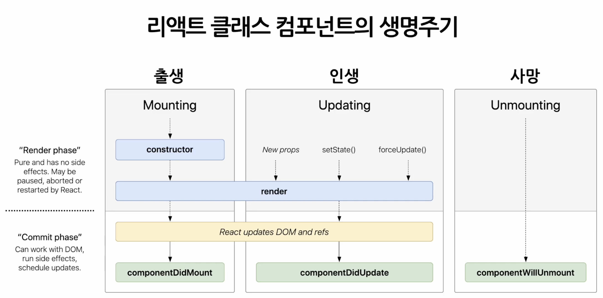

# 리액트 라이브러리

📃 공식문서를 읽으면서 공부한 내용을 정리하고, 토이프로젝트에 직접 적용해봅니다
<br />

# React Documentation

> 참고자료 - [리액트 공식문서](https://reactjs.org/)

## JSX

JSX는 javascript를 확장한 문법으로, html에 js를 같이 사용하는 문법이다. 즉, 컴파일 후 JSX표현식은 일반 js함수 호출이 되고, 일반 js객체로 평가된다.

Babel은 JSX를 `React.createElement()`호출로 컴파일한다. 즉, 아래 두 예제는 동일하다.

```jsx
const element = <h1 className="greeting">hello!</h1>;
```

```jsx
const element = React.createElement('h1', { className: 'greeting' }, 'hello!');
```

다음으로 `React.createElement()`는 아래 예제와 같은 객체를 생성한다. 그리고, 이는 리액트 앱의 가장 작은 빌딩 블록이며, "React 요소"라고 한다.

React-DOM는 이런 객체를 읽고, 사용해 DOM을 해당 React 요소와 일치하도록 구성하고 최신 상태로 유지한다.

```jsx
// Note: this structure is simplified
const element = {
  type: 'h1',
  props: {
    className: 'greeting',
    children: 'Hello, world!',
  },
};
```

<br />

## Rendering Elements

요소는 리액트 앱의 가장 작은 빌딩 블록이며, 화면에 표시하려는 내용을 설명한다.
브라우저 DOM요소와 달리 리액트 요소는 일반 객체고 생성비용이 저렴하다.
참고로, 이런 요소가 모여서 컴포넌트가 된다.

```jsx
const element = <h1>Hello, world</h1>;
```

아래의 `div`태그가 HTML파일 어딘가에 있다고 가정해보자. 내부의 모든 것이 React-DOM에 의해 관리되기 때문에 이를 "root" DOM 노드라고 한다.

```html
// index.html
<div id="root"></div>
```

요소를 렌더링하려면 먼저 위의 DOM요소를 `ReactDOM.createRoot()`에 전달한 다음,

```jsx
const root = ReactDOM.createRoot(
  // root DOM요소
  document.getElementById('root')
);
```

요소를 `root.render()`에 전달한다. 대부분의 리액트앱은 `root.render()`을 한 번만 호출하고, 이렇게 렌더링된 요소는 변경할 수 없다. 요소는 특정 시점의 UI를 나타낸다. 이런 UI를 업데이트하는 유일한 방법은 변경된 요소를 `root.render()`에 전달하는 것이다. React-DOM은 변경된 요소와 이전 요소를 비교하고, 변경된 부분을 DOM에 적용하여 업데이트 한다.

```jsx
const element = <h1>Hello, world</h1>;
root.render(element);
```

<br />

## 컴포넌트와 프롭스(Components and Props)

컴포넌트를 사용하면 ui를 독립적이고 재사용 가능한 부분으로 분할하고, 각 부분을 개별적으로 생각할 수 있다. 개념적으로 컴포넌트는 입력값(props)를 받아서 화면에 보여질 요소(element)를 리턴하는 부분에서 js함수같다.

컴포넌트를 정의하는 가장 간단한 방법은 아래와 같이 js함수를 작성하는 것이다. 이를 **함수 컴포넌트**라고 한다.

```jsx
function Welcome(props) {
  return <h1>Hello, {props.name}</h1>;
}
```

또한 아래와 같이 ES6 클래스를 사용해 컴포넌트를 정의할 수도 있다. 이를 **클래스 컴포넌트**라고 한다.

```jsx
class Welcome extends React.Component {
  render() {
    return <h1>Hello, {this.props.name}</h1>;
  }
}
```

우리는 또한 아래와 같이 **사용자정의 컴포넌트**를 쓸 수 있다.

```jsx
function Welcome(props) {
  // {name: 'Sara'} as the props
  return <h1>Hello, {props.name}</h1>;
}

const root = ReactDOM.createRoot(document.getElementById('root'));
const element = <Welcome name="Sara" />;
root.render(element);
```

그리고 컴포넌트를 함수로 선언하든 클래스로 선언하든 자체 props(입력값)을 수정해선 안된다. 아래와 같이 동일한 입력에 대해 항상 동일한 결과를 반환하는 **순수함수**여야 한다. 즉, props값 자체를 변경하기 보단 복사후 변경하는걸 권장한다.

```jsx
function sum(a, b) {
  return a + b;
}
```

반대로 아래 함수는 입력값을 변경하기 때문에 순수하지 않다.

```jsx
function withdraw(account, amount) {
  account.total -= amount;
}
```

<br />

## 상태(State)

위에서 요소와 컴포넌트에 대해 알아봤다. 그럼 컴포넌트를 업데이트하려면 어떻게 해야할까? 컴포넌트에 "상태"를 추가해야한다.

앞서본 props와 state의 차이점은 아래와 같다.

- props는 부모 컴포넌트가 데이터를 자식 컴포넌트에 전달하는 부분에서 함수에 전달하는 인자같다. 그리고 이름을 사용자가 지정할 수 있다.
- state는 컴포넌트의 메모리와 같다. 컴포넌트가 상호작용에 따라 정보를 추적해서 바꿀 수 있다. 그리고 컴포넌트에 의해서만 제어되므로 private하다.

위의 차이점에도 불구하고 props와 state는 함께 작동한다. 즉, 부모 컴포넌트는 자식 컴포넌트에게 props로 상태를 전달할 수 있다. 하지만 자식 컴포넌트는 전달받은 props값이 어디서 왔는지 알 수 없다. 이를 일반적으로 **"하향식" 또는 "단방향" 데이터 흐름**이라고 한다.

그리고 아래는 `setState()`에 대해 알아야하는 세 가지이다.

- 상태는 직접 수정하면 안된다. 즉, 복사한 뒤에 수정해야한다.

- 상태 업데이트는 **비동기로 동작**한다. 즉, 순서대로 동작하지 않는다. 왜냐면 리액트는 성능을 위해 여러 호출을 단일 업데이트로 일괄처리할 수 있기 때문이다. `setState()`에 객체대신 함수를 사용한다면 동기적으로 동작할 수 있다. 이 함수는 이전 상태와 업데이트가 적용되는 시점의 속성(props)를 인자로 받는다. 이 함수의 컨셉은 리듀서 함수와 비슷하다.

- `setState()`를 호출하면 state중 업데이트된 값만 반영이 된다. 즉, `setState({comments})`는 `state.comments`만 대체한다.

<br />

## 훅과 클로저(Hooks and Closure)

> ### 참고자료
>
> [React Hook은 실제로 어떻게 동작할까?](https://hewonjeong.github.io/deep-dive-how-do-react-hooks-really-work-ko/)

부모 컴포넌트나 자식 컴포넌트 모두 특정 컴포넌트가 상태를 갖고있는지 아닌지 알 수 없고, 함수 또는 클래스 컴포넌트로 정의됐는지 여부를 신경쓰지 않아야 한다. 이것이 상태가 종종 로컬 또는 캡슐화로 불리는 이유다. 상태를 소유한 컴포넌트 이외의 다른 컴포넌트에서는 상태에 접근할 수 없다. 즉, 리액트 훅들은 내부적으로 **클로저**처럼 구현되어있다.

모든 상태는 특정 컴포넌트에 의해 소유되고, 해당 상태에서 파생된 모든 데이터 혹은 UI는 트리에서 하위 컴포넌트에만 영향을 줄 수 있다. 아래는 모든 컴포넌트가 실제로 독립된 컴포넌트라는 것을 보여주는 예시다. 각각의 Clock은 자체 타이머를 설정하고 독립적으로 업데이트된다.

```jsx
function App() {
  return (
    <div>
      <Clock />
      <Clock />
      <Clock />
    </div>
  );
}
```

<br />

## 생명주기(The lifecycle)

모든 리액트 컴포넌트는 아래와 같은 라이프사이클을 갖는다. 즉 컴포넌트가 계속 존재하는 것이 아니라, 시간의 흐름에 따라 생성되고 업데이트 되다가 사라진다.

- 구성요소는 화면에 추가되면서 렌더링 된 이후에 `componentDidMount()`메서드에 의해 마운트 된다.
- 컴포넌트는 새로운 props나 state를 받으면 업데이트 되며, 업데이트 된 후에 `componentDidUpdate()`메서드가 실행된다. 이것은 일반적으로 사용자 상호작용으로 발생한다.
- 구성요소는 화면에서 제거될 때 마운트 해제 되며, 언마운트 직전에 `componentWillUnmount()`메서드가 실행된다.
  

위는 다만 이팩트에 대해서는 생각하지 않는다. 이팩트는 외부 시스템을 현재 props 및 state에 동기화하는 방법이다. 코드가 변경됨에 따라 이 동기화는 자주 발생할 수 있다. 직관적으로 컴포넌트가 마운트되면 React가 동기화를 시작하고, 컴포넌트가 마운트 해제되면 동기화를 중지한다고 생각할 수 있다. 하지만 경우에 따라 구성 요소가 마운트된 상태로 유지되는 동안 동기화를 여러 번 시작하고 중지해야할 수도 있다.

```jsx
const serverUrl = 'https://localhost:1234';

function ChatRoom({ roomId }) {
  useEffect(() => {
    // 아래는 동기화를 시작하는 방법을 지정한다.
    const connection = createConnection(serverUrl, roomId);
    connection.connect();
    // 반환되는 cleanup함수는 동기화를 중지하는 방법을 지정한다.
    // 만약 아무것도 반환하지 않으면, 빈 cleanup함수를 반환한 것 처럼 동작한다.
    return () => {
      connection.disconnect();
    };
  }, [roomId]);
  // ...
}
```

<br/>
<br/>

# React Documentation Beta

> 참고자료 - [리액트 공식문서 베타](https://beta.reactjs.org/)

## Describing the UI

리액트는 ui를 렌더링하기 위한 자바스크립트 라이브러리이다. ui는 버튼, 텍스트, 이미지와 같은 작은 단위로 구성되며, 리액트를 사용하면 이들을 **재사용 가능**하고 **중첩 가능**한 **컴포넌트**로 재결합할 수 있다. 다음은 세 개의 프로필 컴포넌트를 렌더링하는 갤러리 컴포넌트다.

```javascript
function Profile() {
  return ;
}

export default function Gallery() {
  return (
    <section>
      <h1>Amazing scientists</h1>
      <Profile />
      <Profile />
      <Profile />
    </section>
  );
}
```
