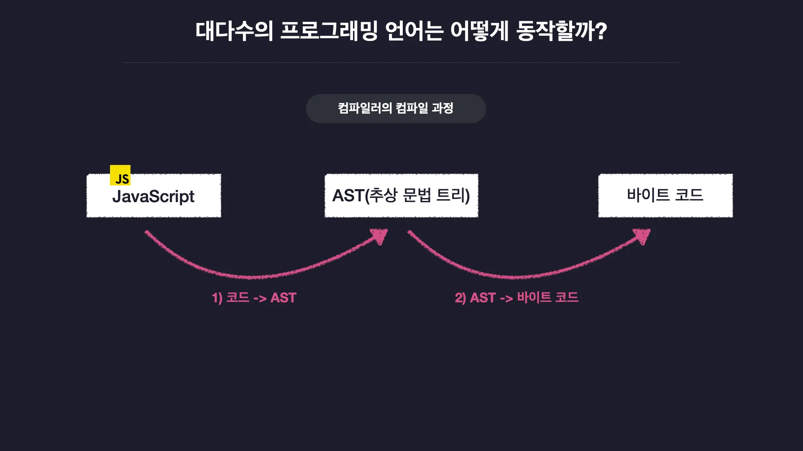

## 자바스크립트의 한계점과 타입스크립트

타입스크립트는 **점진적 타입 시스템**을 사용한다. 즉, 실행 전 검사를 통한 타입 안정성 확보 및 자동으로 변수의 타입을 추론한다.

### 정적 타입 시스템

코드 실행 이전에 모든 변수의 타입을 결정함. 그리고 오류가 있다면 애초에 실행되지 않는다.

### 동적 타입 시스템

코드를 실행하고 나서 그때 그때 마다 유동적으로 변수의 타입을 결정함.

 

## 타입스크립트의 동작 원리

자바스크립트의 컴파일링 과정은 아래와 같다.

1. 컴파일러(자바스크립트 엔진에 포함됨)가 자바스크립트 코드를 추상 구문 트리(abstract syntax tree, AST)로 변환한다.
2. 그리고 인터프리터(자바스크립트 엔진에 포함됨)가 AST를 바이트 코드로 변환하고 컴파일이 종료된다.

 

타입스크립트의 컴파일링 과정은 아래와 같다.
`(참고로, 타입스크립트 컴파일러(TSC)는 npm의 typescript 패키지에 동봉되어 있다.)`

1. 컴파일러(TSC)가 타입스크립트 코드를 추상 구문 트리(abstract syntax tree, AST)로 변환한다.
2. 그리고 컴파일러(TSC)가 코드 상에 타입 오류가 없는지 검사하는 타입 검사가 수행된다.

   - 타입 오류가 있다면 타입 검사가 실패하고 컴파일이 중단된다.
   - 타입 오류가 없다면 타입 검사가 성공하고 AST를 자바스크립트 코드로 변환하고 컴파일이 종료된다.

그래서 타입 오류가 발생한 타입스크립트 코드는 컴파일 시 타입 검사를 통과할 수 없기 때문에 **자바스크립트 코드로 변환되지 않아** 실행할 수 없다. 그리고 타입스크립트에 작성한 타입 관련 코드들은 결국 자바스크립트로 변환될 때 사라지게 되어 프로그램 실행에 영향을 미치지는 못한다.
