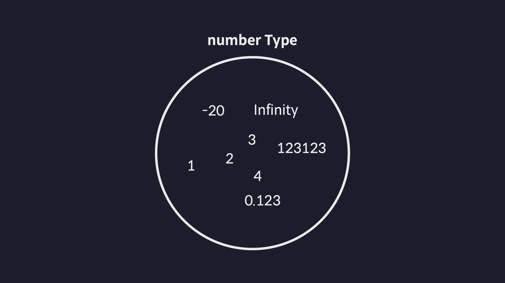
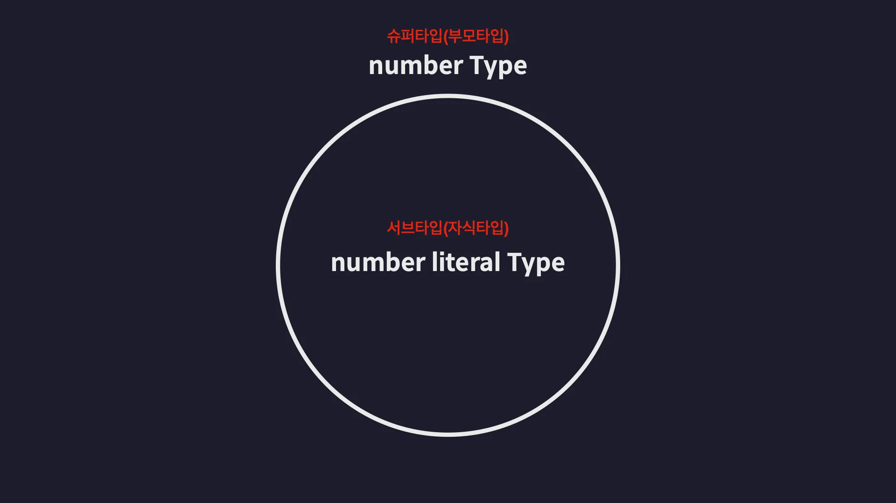
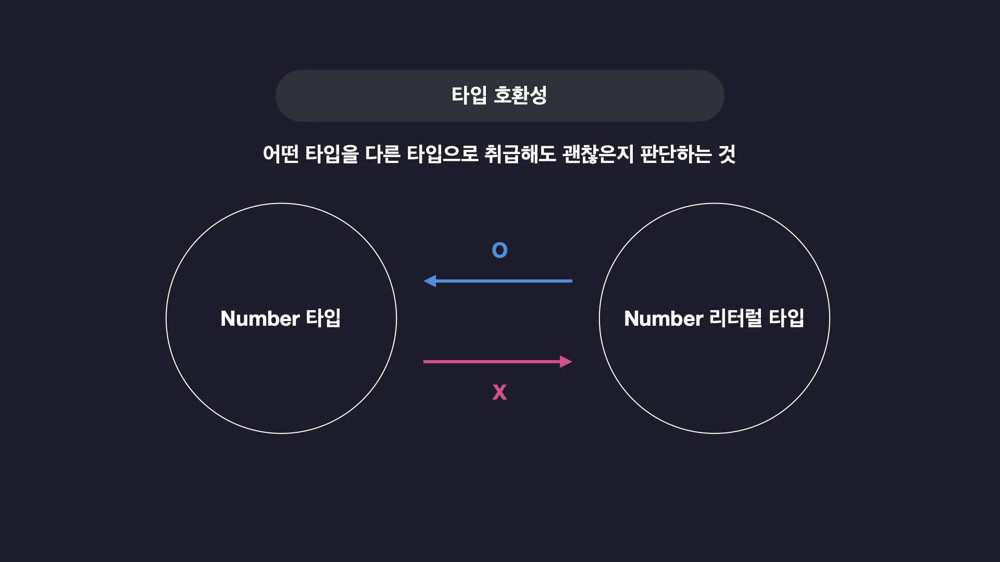
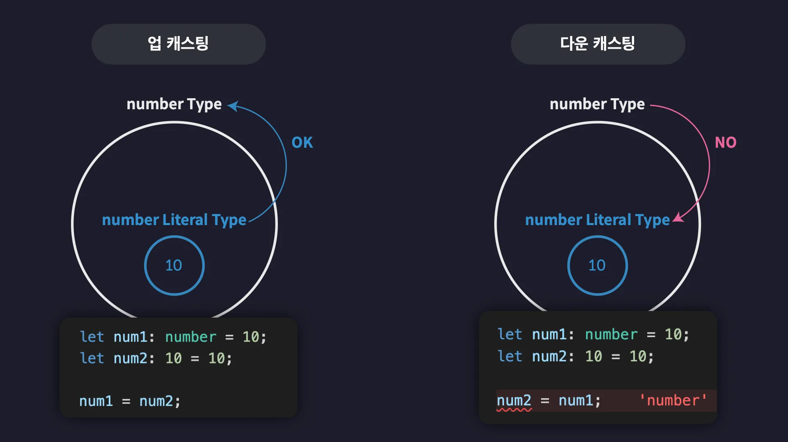

## 타입은 집합이다

타입스크립트가 말하는 '타입'은 **집합**이다.


타입스크립트의 모든 타입들은 **집합**으로써 서로 포함하고 또 포함되는 이런 관계를 갖는다. 그리고 이런 관계에서 Number 타입처럼 다른 타입을 포함하는 타입을 **슈퍼 타입(부모 타입)** 이라고 부른다. 반대는 **서브 타입(자식 타입)** 이라고 한다.


타입들끼리 부모와 자식 관계를 맺으며 다음과 같은 타입 계층도를 이룬다.


### 타입 호환성

어떤 타입을 다른 타입으로 취급해도 괜찮은지 판단하는 것


```javascript
// num1은 숫자 타입
let num1: number = 10;
// num2는 숫자 리터럴 타입
let num2: 10 = 10;

// 숫자타입(부모타입)이 숫자 리터럴 타입(자식타입)보다 상위 집합이므로 이런식으로 할당이 가능하다. 하지만 반대는 안된다.
num1 = num2;
```

**업캐스팅**은 모든 상황에 가능하지만 **다운캐스팅**은 대부분의 상황에 불가능하다.

